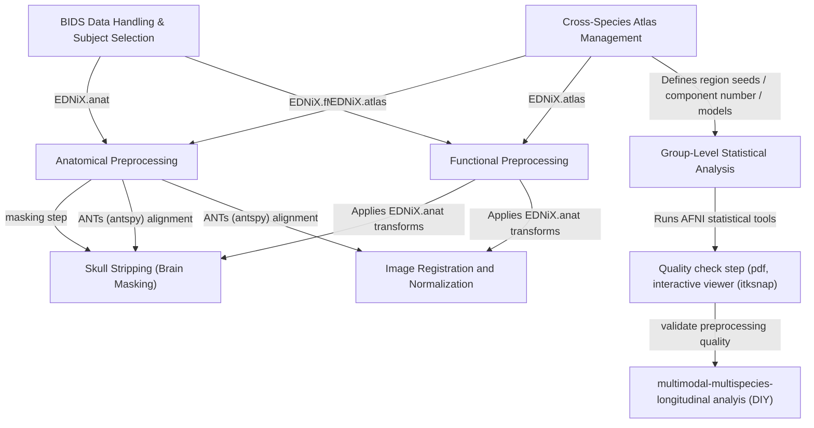
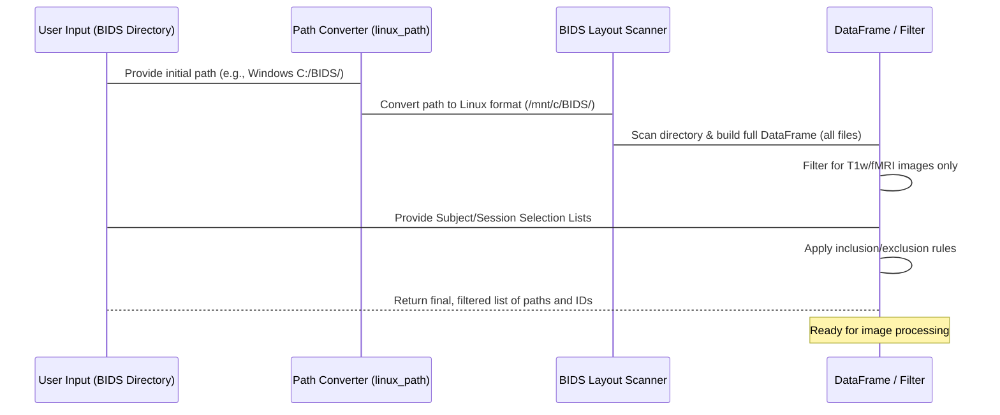
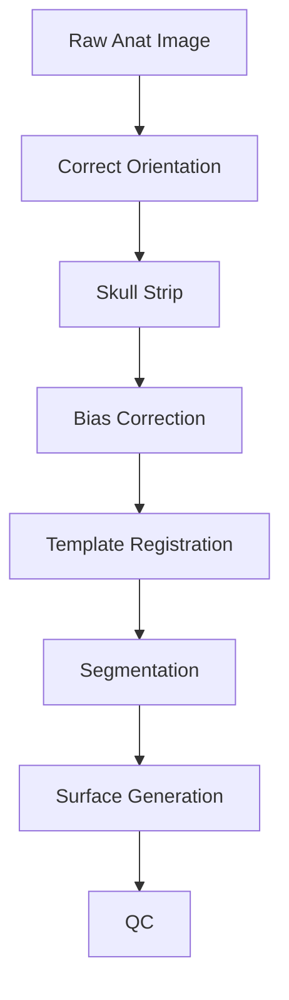
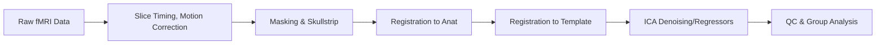
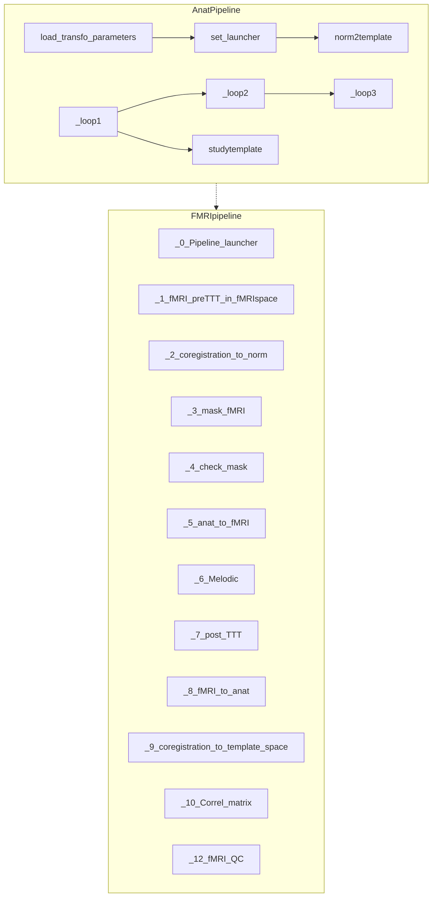
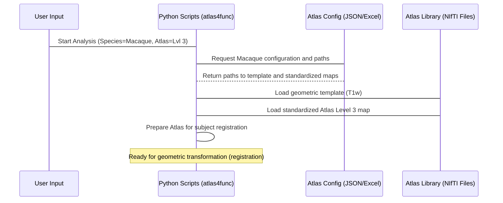

# Tutorial: EDNiX

EDNiX is an integrated neuroimaging software pipeline designed for **multi-species MRI analysis** (human and non-human primates). It handles the complete workflow from parsing **BIDS-compliant data** (Abstraction 0), executing robust **anatomical** and **functional preprocessing** (Abstractions 1 & 2) including dynamic brain masking (Abstraction 4) and precise registration (Abstraction 3). Finally, it enables sophisticated **group statistical modeling** (Abstraction 6) based on pre-transformed cross-species atlases (Abstraction 5), ensuring all computational steps are meticulously logged (Abstraction 7).


## Visual Overview


---

# Core Preprocessing Modules

---

## `set_launcher.py` — Study and Template Setup

Handles initialization of folder paths and references for template spaces, BIDS data loading, and atlas configurations.

- Retrieves reference templates and atlas paths.
- Loads BIDS-compliant subject/session lists.
- Determines masking and bias correction methods.

**Returned Objects:** Paths to templates, masks, atlas labels, subject/session lists, and various configuration values.

---

# BIDS Data Handling & Subject Selection

In [Chapter 1: Cross-Species Atlas Management](01_cross_species_atlas_management_.md), we learned how EDNiX prepares the standardized *maps* (atlases) needed for analysis. Now, we turn our attention to the *territory*—the raw MRI data from the subjects we want to study.

This chapter explains how EDNiX efficiently organizes and selects the specific subjects and files you need from a potentially huge dataset, using the international standard called BIDS.

## 2.1 The Challenge of Data Organization

Imagine you have collected thousands of MRI files across dozens of subjects and multiple sessions. If these files are named inconsistently, an automated pipeline cannot reliably find the "T1 anatomical scan" for Subject 1, Session 2.

The **Brain Imaging Data Structure (BIDS)** solves this. BIDS is a standardized way to organize brain imaging data, ensuring every file sits in the right folder and has a standardized name (e.g., `sub-01/ses-01/anat/sub-01_ses-01_T1w.nii.gz`).

EDNiX’s **BIDS Data Handling system** performs three critical tasks:

1.  **Scanning and Conversion:** Reads the BIDS folders and turns the complex file paths into a simple, searchable table (a Pandas DataFrame).
2.  **Selection:** Allows the user to include or exclude specific subjects or sessions easily.
3.  **Path Correction:** Handles the tricky business of using Windows paths on a Linux processing system (like a cluster or a Singularity container).

## 2.2 Scanning BIDS into a Data Table (DataFrame)

When you point EDNiX toward your BIDS directory, the system first scans all the files and extracts key metadata (Subject ID, Session ID, File Type). It stores this information in a Pandas **DataFrame**, which is essentially a powerful spreadsheet.

This conversion step is essential because it allows EDNiX to query the data quickly, instead of having to search the hard drive repeatedly.

### Step 2.2.1: Initial Scan and Filtering

In your main launch script, EDNiX first calls a tool (often using the external `bids` library or a custom scanner like the one in `Tools/load_bids.py`) to build this master table.

```python
# Simplified scanning process
import pandas as pd
from bids import BIDSLayout

# BIDSLayout scans the directory and validates the structure
layout= BIDSLayout(bids_dir,  validate=True)
df = layout.to_df() # Converts all files found into a DataFrame (table)

# The table (df) contains ALL files. We filter it for T1 anatomical scans:
allinfo_study_c = df[(df['suffix'] == 'T1w') & (df['extension'] == '.nii.gz')]
```

| subject | session | suffix | datatype | path |
| :---: | :---: | :---: | :---: | :--- |
| 01 | 1 | T1w | anat | sub-01/ses-1/anat/.. |
| 01 | 1 | bold | func | sub-01/ses-1/func/.. |
| 02 | 2 | T1w | anat | sub-02/ses-2/anat/.. |

This filtered table (`allinfo_study_c`) now lists exactly which anatomical scans EDNiX needs to process.

## 2.3 Selecting Subjects and Sessions

After creating the master data table, you almost always need to define which subjects or sessions you want to run the analysis on.

EDNiX provides two simple lists for this: `list_to_keep` (inclusion) and `list_to_remove` (exclusion).

### Defining Selection Rules

You define your selection rules using tuples, where each tuple contains the `(Subject ID, Session ID)`.

**Example:** We want to run the analysis on Subject 01, Session 1, but we know Subject 05, Session 2 has bad data and must be excluded.

```python
# Example: Defining exclusion rules
list_to_keep = [] # Empty list means: "Keep everything not explicitly removed"
list_to_remove = [('05', '2')] # Remove subject 05, session 2

# The system applies the filter to the data table
all_ID, all_Session, all_data_path, all_ID_max, all_Session_max, all_data_path_max = \
    Tools.Load_subject_with_BIDS.load_data_bids(
        allinfo_study_c, bids_dir, list_to_keep, list_to_remove)
```

The output of this function is a set of synchronized lists (e.g., `all_ID`, `all_Session`, `all_data_path`) that contain *only* the data you approved for processing.

### Handling Longitudinal Data

A sophisticated feature of the EDNiX selector is its ability to identify the **last session** for each subject, which is essential for longitudinal studies (tracking changes over time).

The filtering function returns two sets of lists:

1.  **General Lists (`all_ID`, `all_Session`):** Includes every subject and session combination that passed the filter.
2.  **Maximum Session Lists (`all_ID_max`, `all_Session_max`):** Includes only the latest available session for each unique subject.

This distinction is crucial for later steps in the pipeline, like calculating group templates or checking the consistency of structural features between the first and last time point.

## 2.4 Internal Workflow: Path Management

One of the most complex parts of working with neuroscience data is handling file paths across different operating systems, especially when using containerization tools like Singularity (which EDNiX often relies on).

If you are running EDNiX on a Windows computer but inside a Linux container, the path `C:\data\project\file.nii.gz` must be translated to the Linux-friendly path `/mnt/c/data/project/file.nii.gz`.

The `Tools/Load_subject_with_BIDS.py` module handles this critical conversion upfront.

### The Path Conversion Process

The function `linux_path` ensures that all file paths used by the pipeline follow the Linux standard (forward slashes `/`). If it detects a Windows drive letter (`C:`), it correctly maps that drive to the `/mnt/c` convention used inside the processing container.

```python
# From Tools/Load_subject_with_BIDS.py (Simplified)
def linux_path(path_input):
    # Ensure all slashes are forward slashes
    linux_path = path_input.replace("\\", "/")

    # Check for and map Windows drive letters (e.g., C:/...)
    if len(linux_path) > 1 and linux_path[1] == ":":
        drive_letter = linux_path[0].lower()
        # Convert C:/path/to/data to /mnt/c/path/to/data
        linux_path = f"/mnt/{drive_letter}" + linux_path[2:]
    return linux_path
```

This ensures that the massive list of file paths (contained in the DataFrame) is reliable before any heavy processing begins.

### Complete Data Handling Flow

Here is the high-level sequence of events when EDNiX initializes the data for a study:



## 2.5 Summary and Next Steps

In this chapter, we learned that EDNiX uses the BIDS standard to organize data efficiently. We saw how the system converts complex folder structures into searchable **Pandas DataFrames**, how we can precisely filter which subjects and sessions to process using **inclusion/exclusion lists**, and how EDNiX handles crucial **platform-specific path conversions** to maintain stability within processing containers.

The output of this stage is a definitive list of anatomical and functional images ready for computation.

The next step is to take these identified images and begin the heavy lifting of preparing them for scientific analysis. Continue to Chapter 3, where we dive into the initial steps of processing the anatomical (structural) scans: [Anatomical Preprocessing Pipeline](03_anatomical_preprocessing_pipeline_.md).

## `_0_Pipeline_launcher.py` — Anatomical Pipeline Orchestrator

This is the main entry point for anatomical preprocessing. It executes a suite of steps including orientation correction, skull-stripping, normalization, template creation, longitudinal coregistration, surface reconstruction, and QC.

- **Function:** `preprocess_anat`
- **Pipeline Steps:**
  1. **Orientation Correction:** Standardizes orientation and performs bias field correction.
  2. **Skull-Stripping:** Applies coarse and fine skull-stripping with multiple method options.
  3. **Normalization:** Registers subject anat to template and study-level templates.
  4. **Segmentation:** Maps standard/atlas labels.
  5. **Surface Generation:** Invokes FreeSurfer-based surface pipeline.
  6. **Longitudinal/Coregistration:** Supports multi-session studies.
  7. **QC & Reporting:** Generates visual and tabular quality reports.



---

## `transfo_T2toT1w.py` — T2w to T1w Image Transformation

Transforms a T2-weighted image into a pseudo-T1w image for pipelines requiring T1-like contrast.

- **Function:** `prepa(file, mask, diary_name)`
- **Logic:** Inverts T2 intensity, rescales, applies mask, and outputs a T1w-like image.

---

## `transfoparams.py` — Transformation Parameter Logic

Defines defaults and logic for selecting/overriding image registration parameters.

- **Function:** `set`
- **Capabilities:** Automatically populates registration parameters for pipeline steps (align, coreg, skullstrip, study template, etc.), or updates them if `do_as_I_said` is specified.

---

## `_loop1.py`, `_loop2.py`, `_loop3.py` — Modular Pipeline Loops

- **_loop1.py:** Handles per-session orientation and initial skullstrip.
- **_loop2.py:** Co-registers individual images to a study template or session reference; applies mask QC.
- **_loop3.py:** Applies back-to-native transforms, builds fMRI masks, prepares data for FreeSurfer, and finalizes QC and output folders.

---

## `_T1_T2_quantif.py` — Quantification of T1/T2 Images

Automates application of bias correction, orientation, and coregistration for T1/T2 quantification. Utilizes AFNI and Singularity containers.

- **Function:** `QuantifT1T2`
- **Workflow:** Applies transformations, creates masks, and aligns atlases.

---

## `noSstrip.py`, `afniskullstrip.py`, `sammbamask.py`, `Skullstrip_method.py`, `qwarpmask.py`, `antsmask.py`, `betmask.py`, `sstripmask.py`, `Unetmask.py`, `epimask.py`, `Histrogram_mask_EMB.py`, `manualmask.py` — Skull Stripping Library

Multiple modules implementing various skullstripping strategies, including:

- **AFNI (`afniskullstrip.py`):** Calls AFNI `3dSkullStrip` with species-specific options.
- **FSL BET (`betmask.py`):** Uses FSL's `bet2` via shell.
- **SynthStrip (`sstripmask.py`):** Deep learning-based skull-stripping.
- **U-Net (`Unetmask.py`):** Custom U-Net-based models.
- **Nilearn (`epimask.py`):** EPI adaptation via `compute_epi_mask`.
- **Sammbamask (`sammbamask.py`):** Uses histogram-based masking heuristics.

All methods produce NIfTI mask outputs and associated JSON metadata, and support logging/QC.

---

## `diary.py` — Logging System

Dynamically sets up loggers for command and verbose output, with logs saved to BIDS directory. Also supports tracing function calls for debugging.

---

## `studytemplate.py`, `_3_make_template.py`, `_4_skullstrip_template.py`, `_5_create_template_brain.py`, `_6_stdyTmax.py`, `_7_stdyT_to_AtlasT.py` — Study Template Creation

Handles the creation of a study-specific template from all input subjects and sessions.

- **Key Steps:**
  - Aggregates preprocessed anat images.
  - Co-registers them using non-linear registration.
  - Applies consensus skullstripping.
  - Maps atlases and builds template-specific label files.
  - Outputs study-level masks, segmentations, and QC.

---

## `backtonative.py` — Back-Transformation to Native Space

Handles transformation of template-space segmentations, masks, and atlases back to the native subject space.

**Data Structure:** Each "package" consists of referential information, source/target files, and transformation lists for both directions.

---

## `FS_freeview.py`, `FS_surf.py`, `FS_flat.py`, `FS_2_WB.py`, `FS_finalise.py`, `preFS.py`, `smallbrain.py`, `FS_modif.py`, `mgz2ants.py` — FreeSurfer Surface Pipeline

Implements surface generation and post-processing using FreeSurfer and related tools:

- **FS_surf.py:** White/pial/midthickness surface construction, inflation, and correction.
- **FS_freeview.py:** Visualization utilities.
- **FS_flat.py:** Flat map generation.
- **FS_2_WB.py:** Conversion of FreeSurfer surfaces to Connectome Workbench format, including resampling, label import, and CIFTI output.
- **preFS.py:** Preparation and normalization for FreeSurfer.
- **smallbrain.py:** Adapts pipeline for very small brains.

---

## `manualaseg.py`, `correctaseg.py` — Manual Segmentation and Correction

Allow for manual editing of aseg files via ITKSNAP or Freeview, followed by smooth correction and header adjustments.

---

## `WB_nuclei.py`, `WB_vol_atlas.py`, `WB_sphere_reg.py`, `WB_label.py`, `WB_ribbon.py` — Surface and Volume Atlas Integration

- **WB_label.py:** Imports and converts volumetric and surface labels for Workbench.
- **WB_ribbon.py:** Generates ribbon volumes for cortex masks.
- **WB_vol_atlas.py:** Handles transfer of surface atlases to volumetric space and vice versa.
- **WB_sphere_reg.py:** Handles sphere-based registration and surface resampling.
- **WB_nuclei.py:** Generates subcortical nuclei surfaces.

---

## `atlas4func.py`, `label_translate.py` — Atlas Management and Translation

- **atlas4func.py:** Loads and prepares atlas configuration and segmentation files.
- **label_translate.py:** Converts between FreeSurfer, ITK, and BIDS label formats.

---

# Functional MRI (fMRI) Processing Modules

## `_0_Pipeline_launcher.py` — fMRI Preprocessing Orchestrator

Entry point for fMRI preprocessing. Mirrors the modular approach of the anatomical pipeline with steps for distortion correction, motion correction, masking, registration, and QC.

- **Key Steps:**
  1. Slice timing correction, despiking, and mean image computation.
  2. Coregistration to anat and template spaces.
  3. Skull-stripping and mask creation for fMRI.
  4. ICA-based denoising and post-processing.
  5. Quality control and matrix-based group analysis.



---

## `_1_fMRI_preTTT_in_fMRIspace.py`, `_2_coregistration_to_norm.py`, `_3_mask_fMRI.py`, `_4_check_mask.py`, `_5_anat_to_fMRI.py`, `_6_Melodic.py`, `_7_post_TTT.py`, `_8_fMRI_to_anat.py`, `_9_coregistration_to_template_space.py`, `_10_Correl_matrix.py`, `_11_Seed_base_many_regionsatlas.py`, `_12_fMRI_QC.py`, `_14_fMRI_QC_matrix.py` — fMRI Processing Steps

These scripts implement each major step in the fMRI pipeline:

- **Coregistration:** Rigid and non-linear registration to anat and template.
- **Motion Correction:** Volumetric and matrix-based correction using ANTs and AFNI.
- **Masking:** Skullstrip and tissue mask generation, including support for manual masks.
- **ICA/MELODIC:** Optional ICA denoising with component selection.
- **QC:** Automated plotting, SNR, DVARS, FD metrics, and advanced matrix and seed-based group analysis.

---

## `transfo_for_func.py` — Functional Image Transformation Utility

Handles application of motion correction and other transformations to fMRI 4D time series, efficiently splitting, transforming, and recombining volumes.

---

# Group Analysis and Visualization

## `_Group_anal_3dLMEr_Mirror.py`, `_Group_anal_3dLMEr_SBA.py`, `_Group_anal__func_DicLearn.py`, `_Group_anal_3dTtest.py`, `_Group_anal_3dLME_dvt_SBA.py` — Group-level Statistical Analysis

Support both voxelwise and surface-based group analyses:

- **Mixed-Effects Modeling:** 3dLMEr or 3dttest++ with flexible design matrices.
- **Seed-Based Analyses:** Mirroring, left/right comparisons, and multi-atlas support.
- **Dictionary Learning:** Data-driven functional atlas creation.

---

## `Plot_intespecies_surfaces.py`, `Plot_BIDS_surface_for_QC.py` — QC and Visualization

- **Surface Area Analysis:** Cross-species surface analysis with violin plots and swarm plots.
- **Surface QC:** Generates HTML summaries of surface QC visualizations for all subjects.

---

# Quality Control (QC) and Data Management

## `_16_anat_QC_SNR.py`, `_mask2_Data_QC.py`, `_200_Data_QC.py`, `_100_Data_Clean.py`

- **QC Metrics:** SNR, tissue contrast, smoothness, registration quality, mask correctness.
- **Cleanup Scripts:** Interactive scripts to remove intermediate files and directories, carefully prompting for user confirmation.

```card
{
  "title": "Best Practice",
  "content": "Always review QC figures and logs after running the pipeline. Visual inspection complements automated reports."
}
```

---

# File Structure and Flow



---

# Summary Table of Key Modules

| File/Module                           | Purpose / Main Responsibility                                                           |
|---------------------------------------|----------------------------------------------------------------------------------------|
| `load_transfo_parameters.py`          | Registration parameter block builder                                                   |
| `set_launcher.py`                     | Study/template paths and config initializer                                            |
| `norm2template.py`                    | Image registration and normalization (ANTsPy)                                          |
| `_0_Pipeline_launcher.py`             | Main anatomical pipeline launcher                                                      |
| `transfo_T2toT1w.py`                  | T2w-to-T1w image conversion                                                           |
| `transfoparams.py`                    | Transformation parameter defaults and logic                                            |
| `_loop1.py`, `_loop2.py`, `_loop3.py` | Modular steps: orientation, skullstrip, co-registration, surface, QC                   |
| `preFS.py`, `FS_surf.py`, etc.        | Surface pipeline: FreeSurfer, midthickness, inflation, sphere reg, etc.                |
| `manualaseg.py`, `correctaseg.py`     | Manual segmentation and correction utilities                                           |
| `studytemplate.py`, `_3_make_template.py`, etc. | Study-level template creation and skullstrip pipeline                       |
| `backtonative.py`                     | Back-transform labels/masks to native space                                            |
| `Skullstrip_method.py`                | Skullstripping method selection and orchestration                                      |
| `sammbamask.py`, `afniskullstrip.py`, etc. | Skullstripping implementations (Sammba, AFNI, FSL, SynthStrip, Nilearn, U-Net, etc.)   |
| `atlas4func.py`, `label_translate.py` | Atlas management, LUT translation                                                      |
| `WB_*`                                | Surface and volume atlas projection; Connectome Workbench integration                  |
| `_0_Pipeline_launcher.py` (fMRI)      | fMRI preprocessing orchestration, modular steps                                        |
| `_3_mask_fMRI.py`                     | Skullstripping and mask generation for fMRI                                            |
| `plot_QC_func.py`                     | QC plotting for fMRI                                                                   |
| `_Group_anal_*`                       | Group-level analysis and statistical modeling                                          |
| `Plot_BIDS_surface_for_QC.py`         | Batch surface visualization and HTML summary                                           |
| `Plot_intespecies_surfaces.py`        | Surface area cross-species analysis                                                    |

---

# Final Notes

- Every processing step generates JSON sidecar files for outputs, ensuring provenance and reproducibility.
- The pipeline is highly modular, supporting customization at every step.
- Logging and QC outputs are critical for verifying pipeline success.
- Extensive use of Singularity containers allows for reproducible, cross-platform execution.

---

```card
{
    "title": "Modularity & Extensibility",
    "content": "You can add new skullstripping, registration, or QC methods by creating a new module and updating the config/routing."
}
```

---

# Detailed Launcher and Skullstrip Options

This section focuses on the configurable options of the anatomical launcher, functional launcher, and skullstripping functions. It also highlights how to provide and reuse your own manual segmentations.

## Anatomical Launcher Options (`anat._0_Pipeline_launcher.preprocess_anat`)

This function controls the entire anatomical preprocessing pipeline. The main arguments define which steps to run, how to register images, and which skullstripping methods to use.

### Core Workflow Control

- **`Skip_step`**  
  - List of integers or strings marking pipeline steps to skip.  
  - For example, `Skip_step=[1, 2]` skips orientation correction and first skullstrip pass.

- **`overwrite_option`**  
  - Boolean flag (`True`/`False`).  
  - If `True`, processing commands add `-overwrite` where supported and overwrite existing files.

- **`creat_study_template`**  
  - Boolean; if `True`, builds a study-specific template after initial subject preprocessing.  
  - Interacts with `which_on` and `coregistration_longitudinal`.

- **`coregistration_longitudinal`**  
  - Boolean; if `True`, uses one session as a reference for longitudinal alignment.  
  - Adjusts how `_loop2` and back-to-native transforms behave.

### Data and Species Configuration

- **`MAIN_PATH`, `bids_dir`**  
  - Paths to EDNiX installation and the BIDS dataset.  
  - Used to locate templates, atlases, and subject directories.

- **`BIDStype`**  
  - Indicates BIDS filename convention (e.g., 1 or 2 or a format string).  
  - Used by `_1_correct_orient` when locating anatomical images.

- **`species`**  
  - String (e.g., `"Human"`, `"Macaque"`, `"Rat"`).  
  - Passed to `templatefeat.get` to select appropriate atlases and templates.

- **`list_to_keep`, `list_to_remove`**  
  - Lists of `(subject, session)` tuples to include or exclude.  
  - Filter the subject list returned by `Load_subject_with_BIDS.load_data_bids`.

### Anatomical Image Types and Orientation

- **`type_norm`**  
  - String, usually `'T1w'` or `'T2w'`.  
  - Normalized by `check_nii.normalize_anat_type` and controls which image drives alignment.

- **`otheranat`**  
  - Optional secondary anatomical contrast (e.g., `'T2w'` if `type_norm` is `'T1w'`).  
  - When defined, `IgotbothT1T2` becomes `True` and myelin mapping is enabled.

- **`masking_img`**  
  - Contrast used to derive brain masks (e.g., `'T1w'`, `'T2w'`).  
  - Normalized via `check_nii.normalize_anat_type`.

- **`orientation`**  
  - Target orientation string (e.g., `'LPI'`).  
  - If empty, automatic orientation from headers is used.

- **`animalPosition`, `humanPosition`**  
  - Lists describing subject positioning on the scanner bed per image type.  
  - `_1_correct_orient` uses them to infer orientation corrections when not explicit in JSON.

### Registration and Transform Options

- **`Align_img_to_template`**  
  - String, usually `'Ants'` or `'No'`.  
  - Determines whether ACPC alignment uses ANTs or is skipped.

- **`list_transfo`**  
  - List of dicts describing each transform stage (e.g., `align`, `coreg`, `SS1`, `SS2`, `SS3`, `stdyT`).  
  - Passed to `transfoparams.set` for default filling.

- **`transfo_message`**  
  - `'do_it_for_me'` or `'do_as_I_said'`.  
  - First option rebuilds `list_transfo` from defaults; second respects user-provided entries and patches missing keys.

- **`MNIBcorrect_indiv`**  
  - Bias field correction method: `'N4'`, `'N3'`, or `''`.  
  - Determines whether `_1_correct_orient` uses `n4_bias_field_correction` or `n3_bias_field_correction2`.

### Skullstrip Choices for Anatomy

- **`brain_skullstrip_1`**  
  - String, skullstrip method for step 1 (`_2_clean_anat`), e.g. `'3dSkullStrip'`, `'Custum_ANTS_Garin'`, `'synthstrip'`, `'Manual'`.  
  - Routed through `Skullstrip_method.Skullstrip_method`.

- **`brain_skullstrip_2`**  
  - String, skullstrip method for subject-specific template brain (`_5_create_template_brain`).  
  - Also handled by `Skullstrip_method.Skullstrip_method` with `SS2` transform parameters.

- **`template_skullstrip`**  
  - Skullstrip method for study template image in `_4_skullstrip_template`.  
  - Uses `SS3` transform configuration.

### Template and Atlas Options

- **`reference`**  
  - Name of reference atlas/template (e.g., `'EDNiX'`, `'MY19'`, `'S1200'`).  
  - Passed to `templatefeat.get`.

- **`atlas_followers`**  
  - List of lists specifying atlas family and level combinations to follow.  
  - Influences which atlases get propagated to native and template spaces.

- **`addatlas`**  
  - Optional atlas name to append dynamically in `_loop3` via `templatefeat.atlas`.  
  - Allows adding extra segmentation schemes.

- **`fMRImasks`**  
  - For fMRI later: `'aseg'` or `'custom'`.  
  - Determines how `preFS.msk_RS` creates masks for resting-state denoising.

### QC and Visualization Options

- **`check_visualy_final_mask`**  
  - Boolean; if `True`, opens viewers (ITK or Freeview) for final masks.  
  - Used in `_2_clean_anat`, `_5_create_template_brain`, and `_loop3`.

- **`check_visualy_each_img`**  
  - Boolean; if `True`, opens viewer windows for each intermediate anatomical image.  
  - Encourages manual QC.

- **`preftool`**  
  - Preferred viewer, `'ITK'` or `'freeview'` (anat side).  
  - Guides `manualmask` and Freeview calls.

- **`force_myelin_same_space`**  
  - Boolean; if `True`, forces T1/T2 alignment solely by resampling so T1/T2-derived myelin maps stay consistent.  
  - Overrides some checks in `myelin.check`.

---

## Functional Launcher Options (`fMRI._0_Pipeline_launcher.preprocess_data`)

The functional launcher orchestrates all fMRI preprocessing steps, including distortion correction, motion correction, masking, denoising, and QC.

### Core Workflow Control

- **`Skip_step`**  
  - List that controls which fMRI steps to skip (1–13 and named flags like `'itk_1'`).  
  - For example, `Skip_step=[6, 7]` disables ICA-based cleaning and post-regression.

- **`overwrite_option`**  
  - Boolean; if `True`, adds `-overwrite` flags.  
  - If `False`, the pipeline avoids overwriting existing fMRI outputs.

- **`resting_or_task`**  
  - String, `'resting'` or `'task'`.  
  - Used by `getpath.func` when building folder structure.

- **`IhaveanANAT`**  
  - Boolean indicating whether an anatomical preprocessing run exists.  
  - If `False`, you must supply a `folderforTemplate_Anat` with anat templates.

- **`do_anat_to_func`**  
  - Boolean; if `True`, performs explicit anat-to-func registration.  
  - Required when anat and fMRI are in different spaces.

- **`anat_func_same_space`**  
  - Boolean; if `True`, the pipeline assumes anat and fMRI are already in the same space.  
  - Simplifies some registration steps and allows direct mask reuse.

### Data and Acquisition Options

- **`MAIN_PATH`, `bids_dir`, `species`, `allinfo_study_c`**  
  - Similar to anat launcher; these define project-level paths and BIDS metadata.  
  - `species` is passed again to `atlas4func.setup` for selection of atlas sets.

- **`endfmri`, `endjson`, `endmap`**  
  - Glob patterns used to locate fMRI NIfTI, JSON, and fieldmap images.  
  - For example, `endfmri='*_bold.nii.gz'`.

- **`TfMRI`, `type_norm`**  
  - `TfMRI` identifies which anat contrast is used for fMRI registration (e.g., `'T2w'`).  
  - `type_norm` must match the anat pipeline normalization contrast.

- **`animalPosition`, `humanPosition`, `orientation`**  
  - Same semantics as anatomical pipeline, but used for fMRI orientation correction.  
  - Passed to `_1_fMRI_preTTT_in_fMRIspace` and `_2b_fix_orient`.

- **`ntimepoint_treshold`**  
  - Minimal number of timepoints a run must have to be included.  
  - Runs with fewer timepoints are skipped and logged as warnings.

### Slice Timing, Distortion, and Motion Options

- **`Slice_timing_info`**  
  - `'Auto'`, AFNI-style string (e.g., `'-tpattern alt+z2'`), or explicit list of timings.  
  - Controls how `_1_fMRI_preTTT_in_fMRIspace` calls `3dTshift`.

- **`T1_eq`**  
  - Number of initial volumes to drop before analysis.  
  - Also used to adjust confounds tsv files.

- **`correction_direction`**  
  - `'Auto'` or explicit direction (`'y'`, `'y-'`, `'x'`, `'x-'`, etc.).  
  - Combined with JSON metadata to configure FSL `fugue` and TOPUP.

- **`DwellT`, `SED`, `TR`, `TRT`**  
  - Strings, often `'Auto'`.  
  - When `'Auto'`, values are read from BIDS JSON; otherwise passed directly to AFNI/FSL tools.

- **`doWARPonfunc`**  
  - Boolean or `'WARP'`/`'header'`; controls if fMRI are deobliqued and warped in header or via reslicing.  
  - Used in `_2b_fix_orient` and `_2_coregistration_to_norm`.

- **`registration_fast`, `type_of_transform`, `n_for_ANTS`, `aff_metric_ants`, `aff_metric_ants_Transl`**  
  - Detailed options for ANTs-based registrations: type (`'BOLDAffine'`, `'SyNCC'`, etc.), interpolation (`'Lanczos'`, `'linear'`), and metrics (`'meansquares'`, `'mattes'`).  
  - Used by `_2_coregistration_to_norm`, `_5_anat_to_fMRI`, and `_9_coregistration_to_template_space`.

### Masking and Skullstrip Options for fMRI

- **`Method_mask_func`**  
  - Chooses fMRI skullstrip method (e.g., `'3dSkullStrip_monkey'`, `'bet2'`, `'CustomNilearn_0.2_0.8'`, `'Manual'`, `'NoSkullStrip'`).  
  - Passed to `Skullstrip_func.Skullstrip_func` in `_3_mask_fMRI`.

- **`dilate_mask`**  
  - Integer controlling dilation for the anat-derived mask used as reference.  
  - Larger numbers create more conservative fMRI masks.

- **`use_erode_WM_func_masks`, `use_erode_V_func_masks`**  
  - Boolean flags; if `True`, use eroded white matter or ventricle masks for regressors.  
  - Connect to `chooseanat` and preFS-based mask generation.

- **`normalize`**  
  - Post-regression normalization: `'zscore'`, `'psc'`, or `'Skip'`.  
  - Handled in `_7_post_TTT.signal_regression`.

### ICA and Post-Regression Choices

- **`ICA_cleaning`**  
  - `'Skip'` or `'MELODIC'`.  
  - `'MELODIC'` triggers `_6_Melodic.Melodic_correct` and interactive ICA component rejection.

- **`nb_ICA_run`**  
  - Number of ICA components to extract per run.  
  - Passed to MELODIC.

- **`post_treatment_method`**  
  - `'AFNI'` or `'Grandjean'`.  
  - `'AFNI'` uses `3dDeconvolve` + `3dTproject`; `'Grandjean'` uses FSL-style regressors plus bandpass and additive mean restoration.

- **`band`**  
  - String bandpass (e.g., `'0.01 0.1'`).  
  - Used to build regressors via `1dBport` or `3dTproject`.

- **`blur`**  
  - Float, spatial smoothing FWHM for residuals.  
  - Applied in `3dTproject` or `3dTstat`/`fslmaths`, depending on post-treatment method.

- **`do_not_correct_signal`**  
  - If `True`, bypasses 3dDeconvolve/Tproject and simply copies cleaned input to residual file.  
  - Useful for debugging and quick checks.

- **`extract_exterior_CSF`, `extract_WM`, `extract_Vc`, `extract_GS`**  
  - Booleans indicating whether to compute average signals for different tissue classes.  
  - Corresponding regressors are saved as `.1D` files and optionally added to the GLM.

### Atlas and Matrix Analysis Options

- **`selected_atlases_matrix`, `wanted_level_matrix`**  
  - Control which atlas levels to use in correlation matrix analysis via `_10_Correl_matrix`.  
  - `'all'` uses every combination; otherwise, a specific list and level.

- **`selected_atlases_SBA`, `panda_files_SBA`, `SBAspace`**  
  - Configure seed-based analysis atlases, ROI definitions (pandas DataFrames), and output spaces (`'func'`, `'anat'`, `'atlas'`).  
  - Used by `_11_Seed_base_many_regionsatlas`.

- **`specific_roi_tresh`, `delta_thresh`**  
  - Thresholds for ROI-specific QC in `_14_fMRI_QC_matrix`.  
  - Help classify specificity categories like `'Specific'`, `'Unspecific'`, `'Spurious'`.

---

## Skullstripping Function Options (Anatomy and fMRI)

Skullstripping is central to both anat and fMRI pipelines. Two main orchestrators exist: `Skullstrip_method.Skullstrip_method` for anatomical images and `Skullstrip_func.Skullstrip_func` for functional images.

### Anatomical Skullstrip Orchestrator (`Skullstrip_method.Skullstrip_method`)

This function selects a specific method based on the `brain_skullstrip` string and applies it to an anatomical image.

- **Core Parameters:**
  - `brain_skullstrip`: Method name (e.g., `'3dSkullStrip'`, `'Custum_ANTS_Garin'`, `'synthstrip'`, `'Manual'`).  
  - `end_maskname`: Filename of a manual or final mask to check before running any method.  
  - `input_for_msk`, `output_for_mask`: Input anat and output mask paths.  
  - `BASE_SS_coregistr`, `BASE_SS_mask`: Reference template and mask for template-based methods (ANTS/Qwarp).  
  - `type_of_transform`, `aff_metric_ants`: ANTs parameters for template-based cleanups.  
  - `check_visualy_final_mask`, `preftool`: Control whether to open manual mask editing tools.

- **Behavior:**
  - If `end_maskname` exists in the masks directory, the function simply copies that file as the final mask and resamples if needed.  
  - Otherwise, it runs the selected method and writes mask plus JSON description.  
  - For the first anatomical skullstrip step, `end_maskname` usually resolves to `<ID>_final_mask.nii.gz`; for the second step it resolves to `<ID>_final_mask2.nii.gz` in the subject’s anat masks folder.

- **Manual Segmentation Option:**
  - Setting `brain_skullstrip='Manual'` triggers `manualmask.do`, which:
    - Creates an initial mask from `input_for_msk` via `3dcalc "step(a)"`.
    - Opens ITKSNAP or Freeview (based on `preftool`) for manual editing.
    - Instructs you to save the edited file as `*_desc-manual.nii.gz`.
    - On exit, replaces the automatic mask with the manually drawn one.
  - You can repeat runs if you delete the final mask; EDNiX will then regenerate.

- **Template-Driven Methods (e.g., `'Custum_ANTS_Garin'`, `'QWARP'`):**
  - Use `antsmask` or `qwarpmask` to project atlas masks into subject space.  
  - Perform morphological operations (dilate, erode, fill holes) to refine the mask.

### Functional Skullstrip Orchestrator (`fMRI.Skullstrip_func.Skullstrip_func`)

This function provides the same flexibility for fMRI mean images in native or ACPC space.

- **Core Parameters:**
  - `Method_mask_func`: Name of fMRI skullstrip method (e.g., `'3dSkullStrip_monkey'`, `'bet2'`, `'CustomNilearn_0.2_0.8'`, `'CustomThreshold_90'`, `'Vol_sammba_2000'`, `'Custom_ANTS_NL'`, `'Manual'`, `'NoSkullStrip'`).  
  - `input_for_msk`, `output_for_mask`: Functional mean image and output mask.  
  - `master`, `maskDilatfunc`: Reference anat in functional space and its dilated mask (for ANTs-based methods).  
  - `type_of_transform`, `aff_metric_ants`: Control ANTs registration when needed.

- **Behavior:**
  - Each method name maps to a specific implementation:
    - `3dSkullStrip*`: AFNI `3dSkullStrip` variants tuned for different species.
    - `bet2`, `_betXX`: FSL BET with fixed or custom `-f` thresholds.
    - `CustomNilearn_*`: Uses Nilearn `compute_epi_mask` plus AFNI cleanups and ANTs smoothing.
    - `CustomThreshold_*`: Applies percentile-based global thresholding.
    - `Vol_sammba_*`: Uses `HistogramMask` from Sammba (via `Histrogram_mask_EMB`).
    - `Custom_ANTS_*`: Template-driven ANTs segmentation using anat-space masks.

- **Manual Segmentation Option:**
  - Setting `Method_mask_func='Manual'`:
    - Creates a binary initial mask using AFNI `3dcalc`.  
    - Opens ITKSNAP on the fMRI mean plus mask.  
    - Requires that you save modifications as the same output file or a `_desc-manual` variant.  
    - Once done, EDNiX writes JSON provenance for the manual mask.

### Using Your Own Manual Masks and Segmentations

You can plug your own segmentations or masks into both anat and fMRI pipelines.

- **For Anatomy:**
  - Create manual brain masks with ITKSNAP or Freeview and save them as:
    - For Step 1 (coarse skullstrip) in the anat masks folder: `<ID>_final_mask.nii.gz`.
    - For Step 2 (template-brain skullstrip) in the same anat masks folder: `<ID>_final_mask2.nii.gz`.
    - Or `*_desc-manual.nii.gz` which `manualmask` detects and copies.
  - For aseg segmentation, `manualaseg.do` lets you correct FreeSurfer aseg volumes:
    - It uses ITKSNAP or Freeview with FreeSurfer LUTs.
    - Edited aseg is smoothed and corrected via `correctaseg.smooth`.
    - The pipeline thereafter uses your corrected aseg as ground truth.

- **For fMRI:**
  - In `_3_mask_fMRI`, the code looks for `ID_final_mask.nii.gz` in the fMRI masks folder:
    - If present, this is resampled to mean fMRI space and used as `ID_fMRI_mask.nii.gz`.
    - The expected filename is `<ID>_final_mask.nii.gz` in the functional masks directory.
    - EDNiX logs that no new skullstrip is performed and that the manual mask is final.
  - Setting `Method_mask_func='Manual'` allows drawing masks directly on the fMRI mean:
    - You can iterate, delete, or update the final mask and rerun.

- **Quality Control Checkpoints:**
  - `_mask2_Data_QC._itk_check_masks` and `_200_Data_QC._itk_check_func_in_template`:
    - Launch ITKSNAP with anatomical or template mean images plus masks.
    - Encourage you to adjust segmentations manually and save them.
  - JSON sidecars always record sources and commands, enabling reproducible manual editing.

```card
{
  "title": "Manual Segmentation Tip",
  "content": "To override any automatic mask, save your edited mask as *_final_mask.nii.gz in the correct masks directory."
}
```

### Detailed List of Anatomical Skullstrip Methods

This list summarizes all `brain_skullstrip` options handled in `Skullstrip_method.py`. Each option tunes AFNI, FSL, ANTs, or DL tools to specific use cases.

- **AFNI 3dSkullStrip family:**
  - `3dSkullStrip`: Generic 3dSkullStrip with blur and dilation.
  - `3dSkullStrip_noDilate`: Same as above but without final dilation.
  - `3dSkullStrip_macaque`: Parameters tuned for macaque brains (`-monkey`, extra dilation).
  - `3dSkullStrip_marmoset`: Parameters tuned for marmoset (`-marmoset`, shrink factor, custom blur).
  - `3dSkullStrip_dog_macaque`: Dog-like heads with macaque settings.
  - `3dSkullStrip_Rat`, `3dSkullStrip_rat`, `3dSkullStrip_rat_no_dil`: Rat-specific options, including special cases for certain IDs and surface-coil acquisitions.

- **Custom EPI / Nilearn-based masks:**
  - `Custum_Macaque`, `Custum_Baboon`, `Custum_mouse`, `Custum_bat`, `Custum_dog`, `custum_rat`: Use `epimask.run` with species-specific histogram cutoffs and AFNI refinements.
  - `CustumNilearn_<low>_<high>`: Generic Nilearn-based mask, then ANTs smoothing and AFNI cleanup.
  - `CustumNilearnExcludeZeros_<low>_<high>`: Same as above but excludes zeros when building histogram.
  - `CustumThreshold_<percentile>`: Thresholds the image at a global percentile, then cleans with ANTs and AFNI.

- **Sammba / Histogram-based methods:**
  - `sammba_mouse`, `sammba_dog`, `sammba_rat`: Use Sammba’s `HistogramMask` via `sammbamask.run` with tuned volume thresholds.
  - `Vol_sammba_<volume>`: Volume-based Sammba mask for arbitrary species.

- **FSL BET-based methods:**
  - `_betXX`: Any string starting with `_bet` uses `betmask.do` with the last digits as F-value.
  - `bet2_ANTS`: Runs BET then refines with ANTs Atropos-based cleanups.

- **ANTS template-driven methods:**
  - `Custum_ANTS_NL`: ANTs nonlinear registration between subject and template, then Atropos-based tissue segmentation.
  - `Custum_ANTS_Garin`: Nonlinear ANTs registration followed by Gaussian smoothing and AFNI morphological cleanup.
  - `CustumANTSGarin_<dil>`: Same as above but with variable AFNI dilation/erosion.
  - `QWARP`, `Custum_QWARP`, `Custum_QWARPT2`, `Custum_QWARPT2_dil`: AFNI 3dQwarp-based mask projection using base template masks.

- **Deep learning–based masks:**
  - `synthstrip`: Uses SynthStrip through `sstripmask.do`.
  - `muSkullStrip_Human`: U-Net model for human data.
  - `muSkullStrip_macaque`: U-Net macaque model.
  - `muSkullStrip_cross_species`, `muSkullStrip_cross_species_dil`: Cross-species U-Net with optional strong dilation.
  - `Custum_Macaque2`: Conditional macaque U-Net with ID-specific extra dilation.

- **Fallback and utility options:**
  - `Custum_Chimp`: Intensity-based thresholding with Nilearn followed by AFNI refinements for chimpanzees.
  - `NoSkullStrip`: Creates a mask from positive voxels only (`step(a)`).
  - `Manual`: Uses ITK-SNAP or Freeview for user-drawn masks; any saved `_desc-manual` mask is taken as final.

### Detailed List of Functional Skullstrip Methods

This list summarizes all `Method_mask_func` options handled in `Skullstrip_func.Skullstrip_func`. Most are lighter-weight or reduced versions of the anatomical methods.

- **AFNI 3dSkullStrip variants:**
  - `3dSkullStrip`: Generic 3dSkullStrip with modest blur and fill holes.
  - `3dSkullStrip_monkey`: Monkey option with additional dilation.
  - `3dSkullStrip_monkeynodil`: Same as monkey but no dilation.
  - `3dSkullStrip_dog`: Uses `-monkey -use_skull` plus intensity thresholding and dilation.
  - `3dSkullStrip_marmoset`: Marmoset option with small blur and slight dilation.

- **FSL BET-based functional methods:**
  - `bet2`: Standard BET with hard-coded F-value (0.70), then AFNI `step(a)` to binarize.
  - `_betXX` (e.g., `_bet070`): BET with custom F-value, then AFNI binarization.

- **Deep learning and cross-species models:**
  - `muSkullStrip_cross_species`: U-Net cross-species model (`model-02-_cross_species-epoch`), followed by AFNI fill holes and optional dilation.

- **Nilearn-based EPI masks:**
  - `CustomNilearn_<low>_<high>`:  
    - Converts input to float via FreeSurfer `mri_convert`.  
    - Runs Nilearn `compute_epi_mask` with given range and `exclude_zeros=False`.  
    - Refines mask with AFNI `3dmask_tool` and ANTs smoothing.
  - `CustomNilearnExcludeZeros_<low>_<high>`:  
    - Same as above but excludes zeros when building histogram.  
    - Again smooths in ANTs and resamples to input.

- **Percentile-based thresholding:**
  - `CustomThreshold_<percentile>`:  
    - Thresholds the functional image at a global percentile using Nilearn `threshold_img`.  
    - Cleans using AFNI `3dmask_tool` and ANTs smoothing and resampling.

- **Sammba / Histogram-based:**
  - `Vol_sammba_<volume>`:  
    - Converts to float, runs `Histrogram_mask_EMB.HistogramMask` with the volume threshold.  
    - Returns a brain mask tuned by that volume.

- **ANTS-based functional masks:**
  - `Custom_ANTS_NL`:  
    - Registers fMRI mean image to anat master, applies dilated anat mask, and keeps largest component.  
    - Very fast since it uses only translation then linear transforms.
  - `Custom_ANTS_Garin`:  
    - Full ANTs nonlinear registration (`type_of_transform`) followed by Gaussian smoothing and AFNI fill holes.  
    - Resamples final mask back to functional grid.

- **Simplest options:**
  - `NoSkullStrip`: Uses AFNI `3dcalc "step(a)"` directly on the functional image.  
  - `Manual`:  
    - Creates an initial `step(a)` mask if none exists.  
    - Opens ITK-SNAP, asking you to save a modified mask.  
    - EDNiX then takes that manual mask as final, writes a JSON sidecar, and keeps it for subsequent runs.

---

# Cross-Species Atlas Management

Welcome to the first chapter of the EDNiX tutorial! This is where we lay the foundation for analyzing brain imaging data, especially when comparing different types of animals—a complex task that requires smart mapping.

## 1.1 What is a Brain Atlas?

Think of a **Brain Atlas** as the map book for the brain. Just like a map of a city divides the land into named neighborhoods, an atlas divides the brain into named regions (like the Hippocampus, Amygdala, or Motor Cortex). Each region is assigned a unique numerical label.

### The Challenge: Cross-Species Comparison

If you want to compare how the brain works in a Human versus a Macaque, you face two major problems:

1.  **Different Maps:** Every species usually has its own unique set of maps, created by different scientists using different conventions. A "Region 50" in one map might mean something completely different than "Region 50" in another.
2.  **Different Shapes:** Even if they have the same regions, a Macaque brain is shaped differently than a Human brain. We need to precisely align the map to the specific brain being studied.

**Cross-Species Atlas Management** is the system in EDNiX designed to solve these problems. It loads, standardizes, and precisely aligns these maps so we can confidently compare anatomy and function across diverse species.

## 1.2 Multi-Level Mapping (Configuration)

One key feature of EDNiX atlases is that they are **multi-level**. This is like having maps of a city at different zoom levels:

| Level | Detail | Example |
| :---: | :---: | :--- |
| **Level 1** | Lowest Detail | Only separates Cortex, Cerebellum, and White Matter. |
| **Level 4** | Highest Detail | Divides the Cortex into dozens of specific, small areas. |

EDNiX manages these levels using configuration files (like Excel sheets or JSON files) which act as universal translators.

### Standardizing Labels (The Translator)

Imagine Atlas A calls the Hippocampus "Label 10," but Atlas B calls it "Label 75." For EDNiX to combine them, it must first translate them into a single standard, say, "EDNiX Label 100."

This standardization is done by reading configuration tables. Let's look at how EDNiX uses a Python script to enforce these rules, relying on AFNI commands (MRI processing tools) to modify the map files (NIfTI volumes).

```python
# File: Transform_orig_atlas_to_EDNiX.py (Simplified Logic)

# Example mapping rule:
# Old label 8 (Sub-region 1) -> New standardized label 3
# Old label 1008 (Sub-region 1, Right) -> New standardized label 42
list_new_label = [3, 42]
list_old_label = [8, 1008]
string_build_atlas = str('')

# Building the transformation command:
for new_label, old_label in zip(list_new_label, list_old_label):
    string_build_atlas = string_build_atlas + '(' + str(int(new_label)) + '*(equals(a,' + str(int(old_label)) + ')))+'

# The final calculation command (using AFNI's 3dcalc):
# '3dcalc -a atlas.nii.gz -expr '(3*(equals(a,8)))+(42*(equals(a,1008)))' -prefix standardized_atlas.nii.gz'
```

This code snippet walks through every point (voxel) in the original atlas image (`a`). If that point matches an `old_label`, its value is instantly replaced by the standardized `new_label`. This ensures that across all species, a specific structure always has the same number in the EDNiX system.

## 1.3 Geometric Transformation (The Resizer)

Once the atlas labels are standardized, we need to make sure the map fits the image data we are analyzing.

Atlases typically exist in a high-resolution, perfect, template brain space. But when you load your actual MRI scan (e.g., from a Pig subject), that subject's brain might be slightly angled or have a different resolution. The atlas must be adjusted to fit the subject's coordinates. This process is called **resampling** and **registration**.

The EDNiX system uses powerful tools (like AFNI's `3dresample`) to stretch or shrink the atlas map so that every labeled region perfectly overlays the subject's brain image.

```python
# File: Transform_orig_atlas_to_EDNiX.py (Simplified Resampling)

# template[0] is the target image space (the subject's scan)
template = '/path/to/subject/T1w.nii.gz'
input_atlas_file = '/path/to/atlas.nii.gz'
output_atlas_file = '/path/to/resampled_atlas.nii.gz'

# Command run inside Singularity container:
command = 'singularity run ... 3dresample -master ' + str(template) + ' -prefix ' + output_atlas_file + ' -input ' + input_atlas_file + ' -overwrite'
# spco(command, shell=True) # Execute the command
```
This simple command tells the system: "Take my labeled map (`-input`) and make its geometry exactly match the target image (`-master`), saving the new version (`-prefix`)."

## 1.4 Loading the Right Map for Analysis

In the previous steps, EDNiX prepared the atlases and stored them in a library. Now, when you start an analysis, EDNiX needs to efficiently pull the correct map for your specific task (e.g., Macaque, Level 3, Functional Analysis).

This selection process is handled by dedicated Python functions that load configurations and paths.

```python
# File: Tools/Read_atlas.py (Simplified)
def load_config(config_path, path_vars):
    """Load config and replace path placeholders."""
    # path_vars = {'atlas_dir': '/data/Atlas/', 'species': 'Macaque'}
    
    with open(config_path) as f:
        config = json.load(f)

    # Example of replacing placeholders dynamically
    base_ss_template = config["paths"]["BASE_SS"] 
    # e.g., 'BASE_SS': '{atlas_dir}/{species}/template_SS.nii.gz'
    
    config["paths"]["BASE_SS"] = base_ss_template.format(**path_vars)
    # Result: /data/Atlas/Macaque/template_SS.nii.gz
    
    return config
```
By using `path_vars` (variables like `species` or `atlas_dir`), EDNiX can dynamically locate the exact files needed without requiring you to manually hardcode long directory paths.

## 1.5 The Atlas Management Workflow

When you request an analysis using a specific atlas (e.g., "EDNIxCSCLR" at Level 3 for a Macaque), here is the streamlined internal process EDNiX follows:



This management system ensures that regardless of the species (Pig, Human, Macaque) or the requested level of detail (Level 1 to 4), the correct, standardized map is provided for every step of the processing pipeline.
